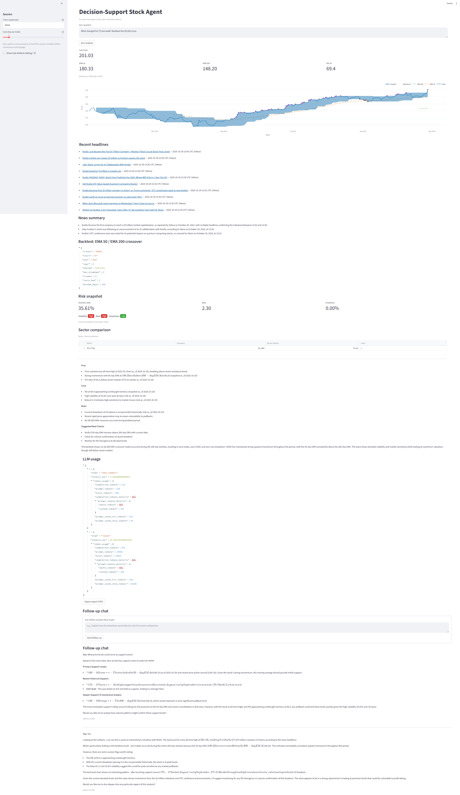

# Decision-Support Stock Analysis Agent


Personal research environment for exploring equities with a guardrailed AI assistant. The agent reasons over locally cached data, computes technical indicators, highlights vetted headlines, and runs lightweight rule-based backtests. It never issues investment directives. Requires Python 3.12+.


  

  
## Features
- Streamlit front end backed by a LangGraph agent for tool orchestration (supports OpenAI or DeepSeek APIs).
- Local-first cache: prices, features, news (Finnhub + optional IR RSS), and DuckDB warehouse.
- Indicator library via `pandas-ta` with validation using Great Expectations.
- VectorBT-powered EMA crossover backtest with adaptive lookback and configurable trading costs.
- Risk dashboard with color-coded metrics, sector-median valuation comparison, and news summaries with fallbacks.
- Plotly trend chart with EMA overlays, support/resistance bands, event markers, and one-click PDF export.

## Quickstart
1. Clone the repository and copy the environment template (supply either `OPENAI_API_KEY` or `DEEPSEEK_API_KEY`):
   ```bash
   git clone https://github.com/Ricardouchub/Stock-Analysis-Agent.git
   cd Stock-Analysis-Agent
   cp .env.example .env
   ```
2. Install dependencies using `uv`:
   ```bash
   uv sync
   ```
3. Ingest price history and build features for a ticker:
   ```bash
   uv run python scripts/ingest_prices.py --ticker AAPL --start 2025-01-01 --end 2025-10-28
   uv run python scripts/build_features.py --ticker AAPL
   uv run python scripts/create_views.py
   ```
4. Launch the Streamlit UI:
   ```bash
   uv run streamlit run app/main.py
   ```
>   *Why per ticker?* Free API tiers (Polygon, Alpha Vantage, Finnhub) enforce tight rate limits. Running the scripts one ticker at a time keeps the project compliant with those limits and avoids noisy failures you’d see with bulk ingestion. Production-scale data pipelines would fan out in parallel, but this personal stack stays lean and polite to free endpoints.

## Guardrails
- Numbers quoted by the assistant must originate from cache or API outputs and include `(source, as_of)`.
- Responses present pros, cons, and risks; the agent never says "buy" or "sell".
- If data is missing or stale, the UI surfaces actionable follow-ups.

## Example Questions

**Price & Trend Analysis**
- “Break down the current trend for {T}: how does the EMA crossover look and where are support/resistance bands forming?”
- “Compare the latest close versus the 52-week high for {T}; is momentum fading?”
- “Walk through the price chart and explain any recent support touches or bearish crossovers.”

**Backtesting Logic**
- “Run the 50/200 EMA crossover backtest for {T} with 10 bps trading costs; how many trades fired and what’s the Sharpe?”
- “The backtest shows few trades—did the adaptive lookback extend the sample? Summarize the implications.”
- “How sensitive is the crossover strategy for {T} if I increase fees to 20 bps?”

**Fundamental & Sector Comparison**
- “Summarize how {T} screens versus its sector medians (P/E, EV/EBITDA, margin). Where is it rich or cheap?”
- “Explain which valuation metric is driving the divergence between {T} and its sector peers.”
- “Highlight any gaps in the sector comparison and suggest follow-up data to fetch.”

**Risk & Volatility Interpretation**
- “Interpret the volatility, beta, and drawdown badges for {T}; how stressed is the name right now?”
- “Drawdown percentile looks elevated—what does that imply for {T} relative to history?”
- “What would you monitor next if the volatility badge stays red?”

**Scenario & Sensitivity Questions**
- “If {T} revisits recent resistance, what downside risk does the current drawdown imply?”
- “How might the risk snapshot change for {T} if beta drifts above 1.2?”
- “Given the sector comparison, what scenarios could close the valuation gap for {T}?”


## Repository Layout
```
Stock-Analysis-Agent/
├── app/
│   ├── agent_graph.py          # LangGraph workflow, routing, news summarizer
│   ├── tools.py                # Data access, backtests, risk & sector helpers
│   ├── main.py                 # Streamlit UI with follow-up chat and export
│   ├── exporter.py             # PDF report generator (ReportLab)
│   ├── components/
│   │   ├── cards.py            # Metrics tiles (EMA, RSI, etc.)
│   │   ├── chart.py            # Plotly chart with support/resistance overlays
│   │   └── panels.py           # Risk badges and sector comparison table
│   └── prompts/system.md       # System-level guardrails
├── scripts/
│   ├── ingest_prices.py        # Price downloader (Polygon/Alpha Vantage)
│   ├── build_features.py       # Indicator builder (pandas-ta)
│   ├── create_views.py         # DuckDB view bootstrap
│   └── run_backtest.py         # CLI backtest entry point
├── workflows/
│   └── daily_prices.py         # Prefect flow for scheduled refresh
├── expectations/
│   └── prices_suite.yml        # Great Expectations validation suite
├── data/                       # Local cache: parquet, DuckDB, logs (gitignored)
├── tests/
│   └── test_agent_graph.py     # Routing & ticker extraction tests
├── .env.example                # API keys and configuration template
├── pyproject.toml              # Project metadata & dependencies
└── README.md                   # Project overview and usage notes
```

## Disclaimer
This project is for educational use only. Market data may be delayed or incorrect. Backtests are not predictive. Taxes, fees, and slippage matter. You are responsible for your decisions.

## Author
**Ricardo Urdaneta**

[LinkedIn](https://www.linkedin.com/in/ricardourdanetacastro/) | [GitHub](https://github.com/Ricardouchub)
